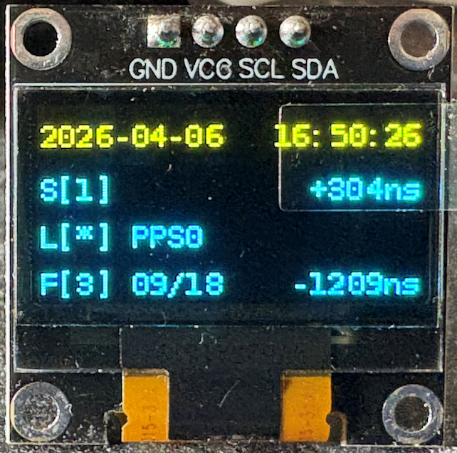

# Simple Display for Raspberry Pi NTP Server

The display shows current NTP time and date, the PPS signal locking state, Stratum level, the offset to the NTP time, the number of satellites that are currently used, and, if no PPS lock is available, alternatively the address of the time server used.

If you see an address of some time server, PPS lock is not (yet) working.

## Hardware requirements

One or more of the following displays:

- HD44780 2004 LCD Display 4x20 characters with I2C interface (the default configuration assumes address 0x27, but this is configurable in `chronotron.yaml`), use for example:
  - Adafruit [LCD 4x20](https://www.adafruit.com/product/198) and [I2C Adapter](https://www.adafruit.com/product/292), description: (https://learn.adafruit.com/i2c-spi-lcd-backpack). Advantage: Stemma QT adapter (QWIIC) that can be also added to [Raspberry PI](https://www.adafruit.com/product/4463#:~:text=The%20SparkFun%20Qwiic%20or%20Stemma%20QT%20SHIM%20for,QT%20or%20Qwiic%29%20connector%20to%20your%20Raspberry%20Pi.) for clean cabling. Note: uses MCP23008 chip—configure `adafruit_hardware: true` in `chronotron.yaml`
  - Amazon kit [sunfounder kit](https://www.amazon.com/SunFounder-Serial-Module-Arduino-Mega2560/dp/B01GPUMP9C)
  - AliExpress kit [TZT Five Star](https://de.aliexpress.com/item/1005001679675215.html

For testing without hardware, the "file" display driver can output to a file.

## Example with HD44780 display

Make sure that I2C is enabled on your Raspberry PI using `raspi-config`.


Connect the LCD Display the GND, 5V and SDA and SCL pins of the Raspberry PI.

> **Note:** Raspberry PI uses 3.3V logic, and the LCD Display is connected to 5V. This _should_ not be a problem, since the LCD only pulls down SDA to ground and the pull-up is on the Pi side. If you want to be on the safe side, either try to power the LCD with **3.3V**, or use a **logic-level-converter**.

> **Note:** I2C configuration is now in `chronotron.yaml`. If your display uses a different address than `0x27` or you have an old Raspberry Pi using `sm_bus=0`, edit the `displays` section in `chronotron.yaml`:
>
> ```yaml
> displays:
>   - type: hd44780
>     i2c_address: 0x20      # if not 0x27
>     sm_bus: 0              # if using Raspberry Pi 1
> ```

> **Note:** if the LCD screen looks inverted or too faint, or no output is visible at all, use the potentiometer on the adapter-board to adjust the contrast.

## Software requirements

> **Note:** Standard Raspberry Pi OS (tested with 'Bookworm' and 'Trixie') is recommended and used below

This project uses `python3-gps` and `python3-smbus` (already available on some distributions).

### Python dependencies

Install the required Python packages:

```bash
sudo apt install python3-gps python3-smbus python3-yaml python3-rich
```

- `python3-gps` - GPS client library for reading satellite data
- `python3-smbus` - I2C bus communication for LCD display
- `python3-yaml` - YAML configuration file parsing
- `python3-rich` - rich terminal dummy LCD for testing (only needed for the rich_terminal display type)

Note: Previous versions of this software relied on `gps-py3`, which was not included in Raspberry Pi OS python libraries and therefore required a venv. This is no longer required. See [PR9](https://github.com/domschl/RaspberryNtpServer/pull/19) for more details on the changes. If you previously used a venv, you might need to update your systemd service file and remove the venv directories.

Note: Trixie requires update to the new dependencies, otherwise GPS satellite status is broken!

## Installation of chronotron software

0. Clone the repository

```bash
git clone https://github.com/domschl/RaspberryNtpServer
cd RaspberryNtpServer/src
```

1. Adapt configuration

All configuration is stored in the `chronotron.yaml` file by default. Edit this file to match your needs.

You can override the location of the YAML file when starting `chronotron.py`:

```bash
python chronotron.py -c /path/to/chronotron.yaml
```

**options** - Control when the backlight is active (for displays that have one), and whether the time is displayed in UTC or local time.

```yaml
options:
  # Backlight always on:
  backlight: true
  display_utc_time: false
```

```yaml
options:
  # Backlight time range:
  backlight:
    start_time: "07:00"
    end_time: "21:00"
  display_utc_time: false
```

Supported values for backlight:

- `true` (boolean) → always on
- `false` (boolean) → always off
- dict with `start_time` and `end_time` (HH:MM, 24-hour format)

### Example: always on

```yaml
options:
  backlight: true
  display_utc_time: false
```

### Example: time range (07:00 to 21:00)

```yaml
options:
  backlight:
    start_time: "07:00"
    end_time: "21:00"
  display_utc_time: false
```

**display_refresh_interval** - Time in seconds between display updates. Use this to control how frequently the display refreshes. Default is 0.25 seconds (~4 fps). Smaller values will make the display more responsive but use more CPU. If you adjust this, you'll probably also want to adjust the chrony data_update_interval.

### Example: custom display refresh rate

```yaml
options:
  backlight: true
  display_utc_time: false
  display_refresh_interval: 0.1  # Update display every 0.1 seconds
```

**layouts** - Configure the layout(s) used to format display content. A layout determines how statistics are presented on the display. Multiple displays can share a single layout, or each display can use a different one. If `layouts:` is omitted, a single `DefaultFourLineLayout` with `id: default` is created automatically.

Each layout entry requires:
- `id` — a unique identifier used to reference this layout from displays
- `type` — the layout type: `DefaultFourLineLayout` or `CustomLayout`

### `DefaultFourLineLayout`

The default layout formats four lines for a 4×20 LCD (or any display with at least 4 rows). Content adapts to the available column width:

- **Line 0**: Date and time, with the UTC offset (e.g. `+0200`) appended if there is room
- **Line 1**: Stratum (`S[n]`) and system time offset from NTP
- **Line 2**: Lock state (`L[*]` / `L[ ]`) and the active NTP/PPS source name
- **Line 3**: GPS fix mode (`F[n]`), satellite count (used/total), and the estimated error of the active chrony source

```yaml
layouts:
  - id: default
    type: DefaultFourLineLayout
```

### `CustomLayout`

`CustomLayout` lets you define the content of each line using template strings. Each template is evaluated as a Python f-string with access to the current statistics and helper functions.

```yaml
layouts:
  - id: my_layout
    type: CustomLayout
    lines:
      - left: "{time.strftime('%Y-%m-%d', current_time)} "
        right: "{time.strftime('%H:%M:%S', current_time)}"
      - left: "S[{stratum or '?'}] "
        right: "{f'{system_time_offset:+.9f}' if system_time_offset else '?'}sec"
      - "L[{'*' if is_locked else ' '}] {source}"
      - left: "F[{mode}] {sats_used}/{sats} "
        right: "{layout._format_signed_offset(adjusted_offset) or '?'}"
```

Each line can be either:
- A **string** — evaluated as an f-string template, left-justified
- A **dict** with `left` and `right` keys, each a template, left- and right-justified on the display according to its width

**Available template variables:**

| Variable | Type | Description |
|---|---|---|
| `current_time` | `time.struct_time` | Current local or UTC time |
| `stratum` | `int \| None` | NTP stratum level |
| `system_time_offset` | `float \| None` | System clock offset from NTP (seconds) |
| `is_locked` | `bool \| None` | NTP synchronisation lock status |
| `is_pps` | `bool \| None` | True if locked to a PPS signal |
| `source` | `str \| None` | Active NTP/PPS source name |
| `adjusted_offset` | `float \| None` | Estimated error of the active chrony source (seconds) |
| `mode` | `str \| None` | GPS fix mode: `None`/`'1'`=no fix, `'2'`=2D, `'3'`=3D |
| `sats` | `int \| None` | Total GPS satellites in view |
| `sats_used` | `int \| None` | GPS satellites used in fix |
| `time` | module | The Python `time` module (e.g. `time.strftime(...)`) |
| `layout` | `CustomLayout` | The layout instance, for calling helper methods |

**Useful layout helper method:**
- `layout._format_signed_offset(seconds)` — formats a float number of seconds as a compact signed string such as `+186ns`, `-1.2ms`, or `+3s`

### Using multiple layouts

Each display can reference a layout by `id`. If no `layout:` key is given on a display entry, it defaults to the layout with `id: default`.

```yaml
layouts:
  - id: default
    type: DefaultFourLineLayout
  - id: compact
    type: CustomLayout
    lines:
      - "{time.strftime('%H:%M:%S', current_time)}"
      - "S[{stratum or '?'}]"
      - "L[{'*' if is_locked else ' '}] {source or ''}"
      - "F[{mode or '-'}] {sats_used or '--'}/{sats or '--'}"

displays:
  - type: hd44780
    i2c_address: 0x27
    layout: default
  - type: file_output
    file: /tmp/compact.txt
    layout: compact
```

**displays** - Configure one or more displays. You **must** specify a `displays` array, with at least one display entry, even if you only have one display. Only specify values that differ from defaults; any omitted keys will use default values.

If you have the standard HD44780 display, you can omit a `chronotron.yaml` file as the defaults include a HD44780 display on I2C address 0x27 on bus 1. However if you create this file at all, you will need to specify displays.

Example with a single HD44780 LCD via I2C:

```yaml
displays:
  - type: hd44780
    i2c_address: 0x27
```

This is the minimal configuration; all other settings use defaults. The defaults are:
- `sm_bus: 1` (standard for Raspberry Pi 2+)
- `adafruit_hardware: false` (for standard PCF8574 adapters)
- `fast_update: false` (faster LCD updates)
- `cols: 20` and `rows: 4` (4x20 LCD display)

**For Adafruit hardware** using the MCP23008 chip at address 0x20:

```yaml
displays:
  - type: hd44780
    i2c_address: 0x20
    adafruit_hardware: true
```


## OLED Display Support



Chronotron now supports OLED displays using `luma.oled`. Pictured is an example 0.96 inch SSD1306 - this one has yellow at the top and cyan at the bottom, but white is also available. It's actually a lot crisper than this photo would suggest.

Example configuration in `chronotron.yaml`:

```yaml
- type: "oled"
  device: "ssd1306"
  i2c:
    bus: 1
    address: 0x3c
  width: 128
  height: 64
  rotate: 0
  # Optional TTF font file path. If omitted the default font (which may be proportionately spaced) is used.
  # font: "/usr/share/fonts/truetype/dejavu/DejaVuSansMono.ttf"
```

Any display supported by `luma.oled` can be used. The device name should match the class in `luma.oled.devices`, such as `ssd1306`, `sh1106` and `ch1115`.

Only I2C is supported currently. The `i2c.bus` is the bus to use (use 1 normally, or 0 for Raspberry Pi 1). The address can be omitted to use the default. Use `i2c-detect -y 1` to discover the address.

If `font` is set, the font file is loaded from the specified path and used to render text. If not set, Chronotron will use the default PIL font which may be proportionately spaced and look rubbish.

**For multiple displays** (e.g., both LCD and file logging for debugging):

```yaml
displays:
  - type: hd44780
    i2c_address: 0x27
  - type: file_output
    file: /tmp/display_log.txt
```

**For terminal-only debugging with rich LCD-style look:**

```yaml
displays:
  - type: rich_terminal
    cols: 20
    rows: 4
    backlight_on_style: "bright_cyan on blue"
    backlight_off_style: "cyan on black"
    max_log_messages: 10
```

When using `rich_terminal`, log messages are automatically displayed in a panel below the LCD display instead of being printed to stdout. This is suitable for interactive use only, not when running as a systemd unit. Log messages are colorised by severity level and the latest messages are shown (scrolling as needed).

**Available display types:**
- `hd44780` - LCD display with HD44780 controller via I2C (PCF8574 or Adafruit MCP23008)
- `file_output` - Write display output to a file (useful for testing and debugging)
- `rich_terminal` - Terminal display using rich, rendered in LCD style

**gpsd** - Configuration for the GPS daemon connection.

Available gpsd options:
- `host` (default: "localhost") - The gpsd server host address
- `port` (default: 2947) - The gpsd server port number

### Example: custom gpsd configuration

```yaml
gpsd:
  host: "127.0.0.1"
  port: 2947
```

**chrony** - Configuration for NTP synchronisation status monitoring.

Available chrony options:
- `method` (default: socket) - Method to get data from chronyd. Can be `chronyc` (legacy method that constantly spawns `chronyc` processes) or `socket` (which connects directly to the chronyd using UDP)
- `host` (default: "localhost") - Hostname or IP address where chronyd is running. Ignored unless `method` is `socket`.
- `port` (default: 323) - Port number where chronyd is listening (`cmdport` in chrony.conf). Ignored unless `method` is `socket`.
- `data_update_interval` (default: 1) - Time in seconds between Chrony statistics updates. Use smaller values for more responsive chrony status updates, larger values to reduce load.

### Example: custom chrony configuration

```yaml
chrony:
  method: socket
  host: "127.0.0.1"
  port: 323
  data_update_interval: 2  # Update NTP status every 2 seconds
```


2. Install dependencies

Install the required Python packages:

```bash
sudo apt install python3-gps python3-smbus python3-yaml
```

Or using pip:

```bash
pip install -r requirements.txt
```

3. Copy the files to `/opt/chronotron`:

```bash
mkdir -p /opt/chronotron
chown -R $USER:$USER /opt/chronotron
# Copy the application files:
cp -r *.py chronotron.yaml layouts/ displays/ /opt/chronotron
```

4. Install the systemd service

```bash
sudo cp chronotron.service /etc/systemd/system
```

Modify this file to run the service as an appropriate user (with the i2c group if your display is I2C).

Enable the systemd server `chronotron` with:

```bash
sudo systemctl enable chronotron
sudo systemctl start chronotron
```

Check, if everthing works:

```bash
sudo systemctl status chronotron
```

If everything worked, the output should be something like:

```
chronotron.service - Display NTP and GPS statistics on a display
     Loaded: loaded (/etc/systemd/system/chronotron.service; enabled; preset: disabled)
     Active: active (running) since Tue 2022-10-25 14:44:17 CEST; 2 months 15 days ago
   Main PID: 370 (chronotron.py)
      Tasks: 2 (limit: 3921)
        CPU: 3d 5h 34min 24.354s
     CGroup: /system.slice/chronotron.service
             └─370 /usr/bin/python /opt/chronotron/chronotron.py

Dec 21 09:38:37 chronotron systemd[1]: Started chronotron.service - Display chrony statistics on a display.
Dec 21 09:38:37 chronotron chronotron.py[2628]: INFO:Chronotron:Chronotron version 2.0.0 starting
Dec 21 09:38:37 chronotron chronotron.py[2628]: INFO:Chronotron:Chrony aquired lock to time source
Dec 21 09:38:37 chronotron chronotron.py[2628]: INFO:Chronotron:Chrony receiving time source from PPS
Dec 21 09:38:37 chronotron chronotron.py[2628]: INFO:Chronotron:Chrony stratum level changed to 1
Dec 21 09:38:37 chronotron chronotron.py[2628]: INFO:Chronotron:Chrony locked to high precision GPS PPS signal
```

## Notes on the display-information


1. Time and date according to NTP
2. The current stratum level is displayed as `S[1]` for stratum level 1. 
3. Shows the output of `chronyc tracking`, entry `system time`, the time difference to the NTP reference (see below for further information).
4. `L[ ]` no lock, `L[*]` lock. A lock (`*`) indicates that time synchronisation is established, either via remote NTP servers or GPS + PPS
5. `PPS` signales that the lock is active using GPS and PPS, the server is in high-precision stratum 1 mode. If instead a hostname is displayed, then PPS is NOT active, and the network is used for time synchronisation, resulting in lower precision.
6. **New** `F[n]`, `n` is the GPS fix type: '-': unknown, 1: no fix, 2: 2D fix, 3: 3D fix.
7. **New** `nn/mm`, nn: used satellites, mm: total seen satellites, including unused ones.
8. Shows output of `chronyc sources`, the last column, "adjusted offset", of the currently active source, which is the estimated error (see below for further information)

### Further information and references

#### `chronyc tracking`

Marked with >>>nnnn.nnnn<<< is the information displayed at (2).
Here, the system is 0.000000100 seconds faster than NTP ref.

```
chronyc tracking
# sample output:
Reference ID    : 50505300 (PPS)
Stratum         : 1
Ref time (UTC)  : Tue Jul 11 07:22:07 2023
System time     : >>>0.000000100<<< seconds fast of NTP time
Last offset     : +0.000000030 seconds
RMS offset      : 0.000010080 seconds
Frequency       : 10.392 ppm fast
Residual freq   : -0.006 ppm
Skew            : 0.005 ppm
Root delay      : 0.000000001 seconds
Root dispersion : 0.000384213 seconds
Update interval : 16.0 seconds
Leap status     : Normal
```

#### `chronyc sources`

Marked with `>>>nnn<<<` is the information displayed at (6).
Here the estimated error of the PPS signal is 591ns

```
chronyc sources -v
# sample output with explanation (-v paramenter):
  .-- Source mode  '^' = server, '=' = peer, '#' = local clock.
 / .- Source state '*' = current best, '+' = combined, '-' = not combined,
| /             'x' = may be in error, '~' = too variable, '?' = unusable.
||                                                 .- xxxx [ yyyy ] +/- zzzz
||      Reachability register (octal) -.           |  xxxx = adjusted offset,
||      Log2(Polling interval) --.      |          |  yyyy = measured offset,
||                                \     |          |  zzzz = estimated error.
||                                 |    |           \
MS Name/IP address         Stratum Poll Reach LastRx Last sample               
===============================================================================
#? GPS                           0   4     0   780    +43ms[  +43ms] +/-  200ms
#* PPS                           0   4     0   782   +186ns[ +217ns] +/-  >>>591ns<<<
^? 2003:2:2:140:194:25:134:>     2  10   377   340   +141us[ +141us] +/-   17ms
^? time.ontobi.com               2  10   377   264   +139us[ +139us] +/-   13ms
^? bblock.dev                    2  10   377   631   +209us[ +209us] +/-   12ms
^? time01.nevondo.com            2  10   377   721   +181us[ +181us] +/-   28ms
^? static.33.250.47.78.clie>     3  10   377  1168   -191us[ -213us] +/-   15ms```
```

#### References

- <https://access.redhat.com/documentation/en-us/red_hat_enterprise_linux/8/html/configuring_basic_system_settings/using-chrony_configuring-basic-system-settings>
- [chronyc documentation](https://github.com/mlichvar/chrony/blob/master/doc/chronyc.adoc)

## Notes:

The `chronotron.py` service checks periodically `chronyc` for NTP statistics (`chronyc` must be in the path!), and uses `gpsd` for the GPS statistics (number of satellites). All configuration is stored in `chronotron.yaml` - no Python code modification needed.

- `chronotron.yaml` - Main configuration file (YAML format) for display settings and timing
- `chronotron.py` - Main application that reads statistics and sends output to configured displays
- `layouts/` - Directory containing layout implementations:
  - `layouts/layout.py` - Abstract base class defining the layout interface and shared helpers
  - `layouts/default_four_line.py` - `DefaultFourLineLayout`: standard 4-line format
  - `layouts/custom_layout.py` - `CustomLayout`: fully configurable line templates
  - `layouts/__init__.py` - Layout factory that instantiates the correct layout based on config
- `displays/` - Directory containing display backend implementations:
  - `displays/display.py` - Abstract base class defining the display interface
  - `displays/hd44780.py` - HD44780 LCD driver via I2C (supports both PCF8574 and Adafruit MCP23008)
  - `displays/file_output.py` - File-based output for debugging and testing
  - `displays/__init__.py` - Display factory that instantiates the correct display based on config
- `button.py` - Currently not used
- `chronotron.service` - Systemd service file for auto-start on boot
- `requirements.txt` - Python package dependencies

## History

- 2025-04-07: 3.0.8: Add keyboard handler to RichTerminalDisplay, `b` to override backlight, `q` to quit, `h` for help.
- 2025-04-06: 3.0.7: Add command line arguments: -v to print version and -c to specify config file location. Update systemd service to hardcode this file add note that chronotron no longer needs to run as root.
- 2025-04-06: 3.0.7: Do not permit use of RichTerminalDisplay if output is not a tty.
- 2025-04-06: 3.0.7: Add backlight_on_contrast and backlight_off_contrast for OledDisplay.
- 2025-04-06: 3.0.6: Add support for OLED displays using luma.oled. Refactor layout to return left and right parts to support proportionately-spaced fonts.
- 2026-04-05: 3.0.5: Remove data_update_interval from gpsd, unnecessary since gps.read blocks waiting for data. This was causing gps data to lag behind and the incoming buffer to grow in versions 3.0.0-3.0.4.
- 2026-04-05: 3.0.4: Refactor layout into a layout class hierarchy.
- 2026-04-05: 3.0.4: Add a DefaultFourLineLayout that is roughly the same as before but has consistent offset formatting and adds UTC offset if there's space.
- 2026-04-05: 3.0.4: Add a CustomLayout that can be fully configured, add an example for a display that is identical to previous layout.
- 2026-04-05: 3.0.4: Fix display refresh interval being artificially limited to 1.
- 2026-04-04: 3.0.3: Refactor chrony client to support both current chronyc method and a new method that communicates with chronyd directly to avoid hammering the system with processes. This is now the default; to revert to using "chronyc", see documentation above.
- 2026-04-04: 3.0.2: Make display_refresh_interval and gpsd and chrony data_update_interval configurable.
- 2026-04-01: 3.0.1: Refactor gpsd and chrony clients into classes, move chronyclient into a thread too, make gpsd host and port configurable.
- 2026-03-31: 3.0.0: Refactored display architecture to support multiple display types and YAML configuration; `hd44780` remains available.
- 2026-03-31: 3.0.0: Added new `rich_terminal` display backend with pretty colour fake LCD and log display (requires `rich` package).
- 2026-03-31: 3.0.0: Added new `file_output` display backend to print to file or stdout.
- 2025-10-09: Support Adafruit's hardware that uses a different I2C chip, the MCP23008
- 2025-10-08: Add I2C port check on display initialization
- 2025-10-05: Update of dependencies, Trixie support (thanks [rglidden](https://github.com/rglidden))
